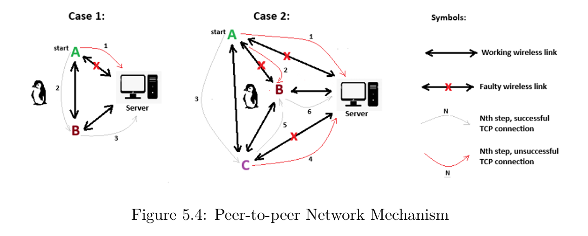

# Light and Scent Repellent System to Deter Honey Badgers from the Penguin Colony

As part of the University of Cape Town's EEE4113F course, this repository contains the system implementation and documentation for Group 31's predator deterrent project. I did the networking and UI part of the project.

  

  <i>Image From Report Showing the Resulting Peer-to-Peer Networking Design</i>

---

## Background

As the EEE4113F design class of 2025, we were challenged with assisting conservationists from BirdLife South Africa by providing innovative solutions to some of the daily challenges they face in conserving the critically endangered African penguin.

The African penguin population has seen a rapid decline in the 21st century and has been classified as critically endangered, with predictions of extinction by 2035. Contributing factors include the migration of the penguins' primary food source (sardines), leading to food scarcity, as well as their vulnerability during annual molting and their susceptibility to predators.

After a presentation by Christina Hagen - whose work focuses on establishing a new African Penguin colony — it became clear that predator attacks pose a significant threat to the already vulnerable birds. As Group 31, our project was aimed at helping Christina and her team deter predators from the colony.

The core challenge was: *How do we keep predators, particularly honey badgers, away from the penguins?* Christina noted that while predator deterrent systems have been deployed globally to prevent livestock predation, predators tend to become habituated when there is no consequence to the deterrent method used.

After intensive research, the literature revealed unexpected characteristics of our target animal. Standing 23–28 cm at the shoulder and measuring 55–77 cm in length, honey badgers are renowned as the most fearless animals in the world - known to confront larger predators like lions and hyenas. Understanding their agility and intelligence led us to focus our solution on their specific weaknesses.

---

## Scope and Limitations

The following constraints were defined for the project:

- **Non-lethal Deterrents:** The system must not cause harm to predators.
- **Protection of Non-target Species:** Deterrents must not disturb non-target species, particularly the penguins.
- **Low Power Consumption:** The solution must be energy-efficient to ensure sustainability.
- **Minimal Data Usage:** The system should operate with low data requirements to reduce operational costs and complexity.
- **Ease of Installation and Portability:** The solution must be straightforward to install and easily relocatable as needed.
- **Weatherproof Design:** The system must be resistant to water and adverse weather conditions to ensure continuous, durable operation.

---

## Proposed Solution

The proposed solution is an animal detection and repellent system that uses **bright strobing lights** and a **desensitising scent spray**.

Honey badgers are nocturnal, meaning they are most active at night and are sensitive to light. Bright strobing lights cause disorientation and increase their vulnerability. Research also revealed that honey badgers rely heavily on smell for hunting, and are repelled by strong scents such as garlic, mint, vinegar, cinnamon, and citronella oil. The spray is used to create a scent barrier around the penguin colony that deters approaching predators.

In addition, a networking and user interface system was developed to transmit detection events to conservationists at BirdLife South Africa, alerting them in real time to any intrusions near the colony.

This solution directly targets the predator's known weaknesses, remains non-lethal, avoids distressing the penguins, and keeps end-users informed when detection events occur.

